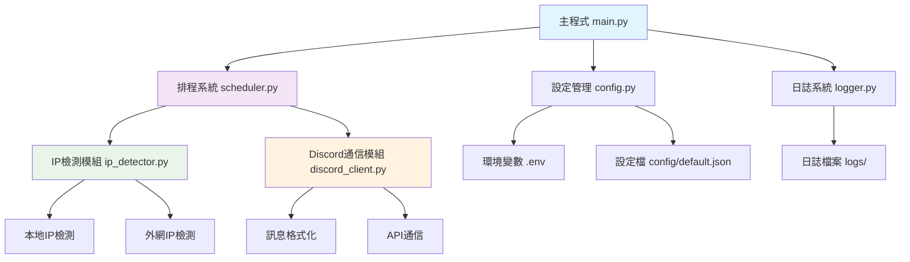
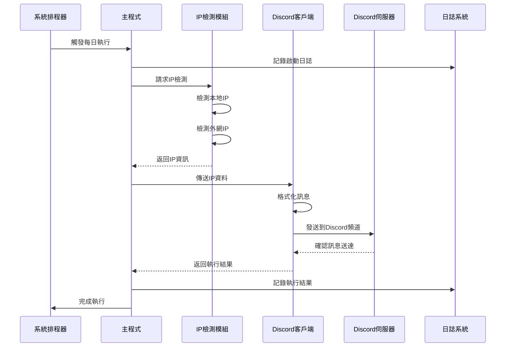

# Discord IP 機器人專案規格文件

## 📋 專案概述

### 專案名稱
Discord IP Bot - 自動化IP地址監控與通知機器人

### 專案描述
這是一個自動化的Discord機器人系統，透過本地腳本每日定時檢查本機IP地址，並將IP資訊發送到指定的Discord伺服器頻道。系統設計為輕量級、高可靠性的監控解決方案。

### 核心功能
- 🔍 自動檢測本機IP地址（內網IP與外網IP）
- 📅 每日定時自動執行
- 💬 發送格式化訊息到Discord頻道
- 📝 完整的日誌記錄與錯誤處理
- 🔒 安全的設定檔管理
- 🖥️ 跨平台支援（Windows、Linux、macOS）

## ✅ 技術可行性評估

### 整體評估：完全可行 ⭐⭐⭐⭐⭐

| 技術領域 | 可行性 | 難度等級 | 風險評估 |
|---------|--------|----------|----------|
| IP地址檢測 | ✅ 完全可行 | 簡單 | 低風險 |
| Discord API通信 | ✅ 完全可行 | 簡單 | 低風險 |
| 排程系統 | ✅ 完全可行 | 簡單 | 低風險 |
| 跨平台部署 | ✅ 完全可行 | 中等 | 中風險 |
| 錯誤處理 | ✅ 完全可行 | 中等 | 低風險 |

### 技術優勢
- Python生態系統成熟，有豐富的相關庫
- Discord API穩定且文件完善
- IP檢測技術成熟可靠
- 排程技術在各平台都有原生支援

### 潛在挑戰與解決方案
1. **網路連線穩定性** → 實現重試機制與離線處理
2. **Discord API速率限制** → 合理控制請求頻率
3. **權限設定複雜性** → 提供詳細設定指南
4. **跨平台差異** → 使用跨平台庫和標準化配置

## 🎯 任務分解與開發階段

### 第一階段：專案基礎建設
- [x] **任務1.1**: 專案目錄結構建立 ✅ **已完成**
- [x] **任務1.2**: 基礎配置文件創建 ✅ **已完成**
- [x] **任務1.3**: 依賴管理設定 ✅ **已完成**
- [x] **任務1.4**: 開發環境設定指南 ✅ **已完成**

### 第二階段：核心模組開發
- [x] **任務2.1**: IP檢測模組開發 ✅ **已完成**
  - ✅ 本地IP檢測功能 (MacOS測試通過)
  - ✅ 公共IP檢測功能 (多服務備援)
  - ✅ IP變化比較功能
  - ✅ 歷史記錄管理
  - ✅ 跨平台相容性 (MacOS驗證)
  - ✅ 完整單元測試與整合測試
- [x] **任務2.2**: Discord通信模組開發 ✅ **已完成**
  - ✅ Discord Webhook API 通信功能 (MacOS測試通過)
  - ✅ 優化訊息格式化 ("Minecraft Server IP: {ip}:25565")
  - ✅ 完整錯誤處理與重試機制
  - ✅ 跨平台相容性 (MacOS驗證)
  - ✅ 完整單元測試 (22/22 通過)
  - ✅ 模組整合測試 (與IP detector整合)
  - ✅ 簡化環境變數設定 (只需DISCORD_WEBHOOK_URL)
- [ ] **任務2.3**: 設定管理模組開發
- [ ] **任務2.4**: 日誌系統模組開發

### 第三階段：排程與整合
- [ ] **任務3.1**: 排程系統實現
- [ ] **任務3.2**: 主程式邏輯整合
- [ ] **任務3.3**: 錯誤處理機制
- [ ] **任務3.4**: 單元測試撰寫

### 第四階段：部署與文件
- [ ] **任務4.1**: 部署腳本開發
- [ ] **任務4.2**: 使用者文件撰寫
- [ ] **任務4.3**: 跨平台測試
- [ ] **任務4.4**: 效能優化

## 🏗️ 專案架構設計

### 目錄結構
```
discord-IP-bot/
├── src/                    # 主要程式碼目錄
│   ├── __init__.py
│   ├── ip_detector.py      # IP檢測模組
│   ├── discord_client.py   # Discord通信模組
│   ├── scheduler.py        # 排程管理模組
│   ├── config.py          # 設定管理模組
│   └── logger.py          # 日誌系統模組
├── main.py                # 主程式進入點
├── requirements.txt       # Python依賴套件
├── setup.py              # 安裝腳本
├── .env.example          # 環境變數範例
├── .env                  # 實際環境變數（git ignore）
├── config/               # 設定檔目錄
│   └── default.json      # 預設設定檔
├── logs/                 # 日誌檔目錄
├── scripts/              # 部署與維護腳本
│   ├── install.sh        # Linux/Mac安裝腳本
│   ├── install.bat       # Windows安裝腳本
│   └── setup_cron.sh     # 排程設定腳本
├── tests/                # 測試檔案
│   ├── test_ip_detector.py
│   ├── test_discord_client.py
│   └── test_config.py
├── docs/                 # 文件目錄
│   ├── setup_guide.md    # 設定指南
│   └── troubleshooting.md # 故障排除
├── README.md             # 專案說明文件
├── spec.md              # 本規格文件
└── .gitignore           # Git忽略檔案清單
```

### 系統架構圖


### 資料流程圖


## 🔧 技術實現方案

### 程式語言與框架選擇
- **主要語言**: Python 3.10 (在 venv 虛擬環境內執行)
- **Discord庫**: discord.py 或 requests (Webhook方式)
- **排程庫**: schedule 或 APScheduler
- **設定管理**: python-dotenv, configparser
- **日誌系統**: logging (內建模組)
- **網路請求**: requests, urllib3
- **重要**: 所有模組必須解耦設計，確保可獨立測試，並保證跨平台相容性 (MacOS, Windows 10/11)

### 核心模組設計

#### 1. IP檢測模組 (ip_detector.py)
```python
class IPDetector:
    """IP地址檢測類別"""
    
    def get_local_ip(self) -> str:
        """獲取本地內網IP地址"""
        pass
    
    def get_public_ip(self) -> str:
        """獲取外網IP地址"""
        pass
    
    def get_all_ips(self) -> dict:
        """獲取所有IP資訊"""
        pass
    
    def compare_with_last(self, current_ips: dict) -> bool:
        """與上次記錄比較是否有變化"""
        pass
```

#### 2. Discord通信模組 (discord_client.py)
```python
class DiscordClient:
    """Discord Webhook 通信客戶端"""
    
    def __init__(self, webhook_url: str, config: dict = None):
        """初始化Discord Webhook客戶端 (只需要Webhook URL)"""
        pass
    
    def send_ip_notification(self, ip_address: str) -> bool:
        """發送Minecraft伺服器IP通知"""
        pass
    
    def send_minecraft_server_notification(self, ip_data: dict) -> bool:
        """發送Minecraft伺服器通知 (只使用公共IP)"""
        pass
    
    def test_connection(self) -> bool:
        """測試Discord連線狀態"""
        pass
```

#### 3. 設定管理模組 (config.py)
```python
class ConfigManager:
    """設定檔管理器"""
    
    def load_config(self) -> dict:
        """載入設定檔"""
        pass
    
    def validate_config(self, config: dict) -> bool:
        """驗證設定檔完整性"""
        pass
    
    def get_discord_config(self) -> dict:
        """獲取Discord相關設定"""
        pass
    
    def get_schedule_config(self) -> dict:
        """獲取排程相關設定"""
        pass
```

### 設定檔格式

#### 環境變數 (.env)
```env
# Discord Webhook 設定 (唯一需要的Discord配置)
DISCORD_WEBHOOK_URL=https://discord.com/api/webhooks/YOUR_WEBHOOK_ID/YOUR_WEBHOOK_TOKEN

# 應用程式設定
APP_NAME=Discord IP Bot
LOG_LEVEL=INFO
SCHEDULE_TIME=08:00

# IP檢測設定
CHECK_PUBLIC_IP=true
CHECK_LOCAL_IP=true
IP_CHECK_TIMEOUT=10
```

#### 設定檔 (config/default.json)
```json
{
  "app": {
    "name": "Discord IP Bot",
    "version": "1.0.0",
    "timezone": "Asia/Taipei"
  },
  "discord": {
    "message_template": "🌐 **IP地址通知** 🌐\n📅 時間: {timestamp}\n🏠 本地IP: {local_ip}\n🌍 外網IP: {public_ip}\n📊 狀態: {status}",
    "retry_attempts": 3,
    "retry_delay": 5
  },
  "ip_detection": {
    "public_ip_services": [
      "https://ipify.org",
      "https://icanhazip.com",
      "https://ident.me"
    ],
    "timeout": 10,
    "retry_attempts": 3
  },
  "logging": {
    "format": "%(asctime)s - %(name)s - %(levelname)s - %(message)s",
    "max_file_size": "10MB",
    "backup_count": 5
  }
}
```

## 🔒 安全性考量

### 敏感資訊保護
1. **Discord Token安全**
   - 使用環境變數儲存
   - 絕不硬編碼於程式中
   - 加入.gitignore防止意外提交

2. **IP資訊隱私**
   - 提供IP部分遮蔽選項
   - 記錄日誌時遮蔽敏感部分
   - 支援僅通知IP變化而非完整IP

3. **權限控制**
   - Discord機器人最小權限原則
   - 僅授予必要的訊息發送權限
   - 定期檢查機器人權限狀態

### 錯誤處理策略
```python
# 網路錯誤處理範例
try:
    ip_data = ip_detector.get_all_ips()
    discord_client.send_message(ip_data)
except NetworkError as e:
    logger.error(f"網路連線失敗: {e}")
    # 實施重試機制
except DiscordAPIError as e:
    logger.error(f"Discord API錯誤: {e}")
    # 記錄錯誤，稍後重試
except Exception as e:
    logger.critical(f"未預期錯誤: {e}")
    # 發送緊急通知
```

## 📦 部署與維護

### 安裝需求
- Python 3.10
- Python venv 虛擬環境  
- 網路連線
- Discord Webhook URL (從Discord伺服器設定中取得)

### 安裝步驟
1. **複製專案**
   ```bash
   git clone https://github.com/username/discord-IP-bot.git
   cd discord-IP-bot
   ```

2. **安裝依賴**
   ```bash
   pip install -r requirements.txt
   ```

3. **設定環境變數**
   ```bash
   cp .env.example .env
   # 編輯.env檔案，填入Discord Webhook URL
   ```

4. **測試執行**
   ```bash
   python main.py --test
   ```

5. **設定排程**
   - Linux/Mac: 使用cron
   - Windows: 使用工作排程器

### 排程設定範例

#### Linux/Mac (cron)
```bash
# 每天早上8點執行
0 8 * * * /usr/bin/python3 /path/to/discord-IP-bot/main.py
```

#### Windows (Task Scheduler)
```powershell
# 使用PowerShell建立排程工作
$action = New-ScheduledTaskAction -Execute "python" -Argument "C:\path\to\discord-IP-bot\main.py"
$trigger = New-ScheduledTaskTrigger -Daily -At "08:00"
Register-ScheduledTask -TaskName "Discord IP Bot" -Action $action -Trigger $trigger
```

### 監控與維護
- 定期檢查日誌檔案
- 監控Discord機器人狀態
- 定期更新依賴套件
- 備份設定檔案

## 📊 效能與可靠性

### 效能指標
- 執行時間: < 30秒
- 記憶體使用: < 100MB
- 網路請求: < 5個API呼叫
- 檔案大小: 整個專案 < 50MB

### 可靠性設計
- 重試機制: 網路失敗自動重試3次
- 逾時處理: 所有網路請求10秒逾時
- 異常恢復: 程式異常自動記錄並優雅退出
- 資料備份: IP變化歷史記錄儲存

## 🔮 未來擴展計畫

### 第二版功能
- [ ] Web管理介面
- [ ] 多Discord伺服器支援
- [ ] IP地理位置資訊
- [ ] 歷史資料圖表
- [ ] 移動應用程式通知

### 第三版功能
- [ ] 容器化部署 (Docker)
- [ ] 雲端服務整合
- [ ] 進階分析功能
- [ ] API開放平台

## 📈 開發時程

| 階段 | 時間估計 | 主要任務 |
|------|----------|----------|
| 第一階段 | 0.5天 | 專案建設、環境設定 |
| 第二階段 | 1.5天 | 核心模組開發 |
| 第三階段 | 1天 | 整合與測試 |
| 第四階段 | 1天 | 部署與文件 |
| **總計** | **4天** | **完整專案交付** |

## 📝 驗收標準

### 功能驗收
- ✅ 能成功檢測本地IP和外網IP
- ✅ 能正確發送訊息到Discord頻道
- ✅ 排程功能正常運作
- ✅ 錯誤處理機制完善
- ✅ 日誌記錄完整

### 品質驗收
- ✅ 程式碼遵循PEP 8規範
- ✅ 完整的錯誤處理
- ✅ 詳細的程式碼註釋
- ✅ 跨平台相容性
- ✅ 安全性檢查通過

### 文件驗收
- ✅ 完整的README.md
- ✅ 詳細的設定指南
- ✅ 故障排除文件
- ✅ API文件說明

---

## 📞 技術支援

如有任何技術問題或需要協助，請參考：
- 📖 [設定指南](docs/setup_guide.md)
- 🔧 [故障排除](docs/troubleshooting.md)
- 💬 GitHub Issues

---

**文件版本**: v1.0  
**最後更新**: 2024年12月  
**文件狀態**: ✅ 已完成